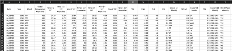

#
# = Proyecto de Análisis del Fenómeno ENSO =

  

## Descripción del Proyecto

Este proyecto se enfoca en la exploración y análisis del fenómeno El Niño-Oscilación del Sur (ENSO), así como en la creación de un modelo predictivo para los valores de anomalía de ENSO. El proyecto consta de dos partes principales: el Análisis Exploratorio de Datos (EDA) y la aplicación de técnicas de aprendizaje automático para predecir las anomalías de ENSO. 

#
## Tabla de Contenidos
- [Información sobre ENSO](#información-sobre-enso)
- [Conjunto de Datos](#conjunto-de-datos)
- [Análisis Exploratorio de Datos](#análisis-exploratorio-de-datos)
- [Modelo de Aprendizaje Automático](#modelo-de-aprendizaje-automático)
- [Resultados](#resultados)
- [Contribución](#contribución)
- [Referencias](#referencias)
#
## Información sobre ENSO

El **El Niño-Oscilación del Sur (ENSO)** es un fenómeno climático natural que afecta las temperaturas del océano Pacífico y, a su vez, tiene un impacto significativo en los patrones climáticos en todo el mundo. Comprender el ENSO es esencial para predecir eventos climáticos extremos y fenómenos naturales como sequías e inundaciones.

Para obtener información detallada sobre el ENSO, su origen y su importancia, consulta esta fuente de [CONAGUA](https://smn.conagua.gob.mx/es/climatologia/diagnostico-climatico/estatus-del-nino).
#
## Conjunto de Datos

Para este proyecto, se ha utilizado un conjunto de datos relacionado con el ENSO. El conjunto de datos contiene información sobre diferentes variables climáticas y valores de anomalía de ENSO a lo largo del tiempo. Se ha utilizado para realizar el EDA y en la construcción del modelo predictivo.
Este se obtuvo del siguiente enlace de [Kaggle](https://www.kaggle.com/datasets/shabanamir/enso-data), el cual contiene datos interesantes, como se muestra a continuación:

  

Si bien, la página recomendada contenía buenos elementos, al final se decidió utilizar este dataset por las métricas con las que contaba.

#
## Análisis Exploratorio de Datos

Como parte de las consignas, se debía realizar un EDA interesante, que pudiera darnos una idea clara de los datos con los que se trabajarán. 

A continuación, se muestran algunas visualizaciones interesantes:

### Distribución de Anomalías de Temperatura Global

  

### Matríz de Correlación entre Variables

  

### Promedio de Anomalías de Temperatura Global por Año

  

**[Código de EDA (eda.ipynb)](EDA.ipynb)**
#
## Modelo de Aprendizaje Supervisado para Predicción de Anomalías de ENSO

En este proyecto, se desarrolló un modelo de machine learning para predecir las anomalías de ENSO (El Niño-Southern Oscillation) de tipo aprendizaje supervisado. El objetivo principal es anticipar las anomalías de ENSO en función de las características climáticas y oceánicas disponibles en el conjunto de datos.

### Características del Modelo

- **Algoritmo de Aprendizaje Supervisado:** Para este proyecto, se usó el algoritmo SARIMAX (Seasonal Autoregressive Integrated Moving Average with eXogenous regressors) como nuestro modelo predictivo. El modelo SARIMAX se consideró el adecuado, ya que como sabemos, lo podemos usar para problemas de series temporales, y por su sólida base estadística para hacer predicciones.
Además que se probó un modelo de Regresión Lineal, porque se pretendía solamente usar la columna de temperaturas gloables, sin tomar en cuenta nada más, pero las predicciones no eran muy buenas.

  

Con las siguientes calificaciones:

  

Entonces se concluyó que el modelo no es el adecuado.  

- **Selección de Características:** A través de un proceso  de análisis exploratorio de datos (EDA), identifiqué y utilizé las características relevantes para la predicción de anomalías de ENSO. Estas características son: 
  - Año
  - Mes
  - Anomalías de Temperaturas Globales   
  Si bien, no se utilizan todas las características interesantes que se vieron en el EDA, se utiliza la que engloba las anomalias de temperatura, como resultado del cálculo usando las demás variables, es decir, el dataset ya nos mostraba la variable a predecir como resultado del uso previo de las variables necesarias para calcularla.  

- **Conjunto de Datos de Entrenamiento y Prueba:** El modelo SARIMAX se ajustó utilizando todos los datos disponibles y seleccionados en el conjunto de datos sin dividirlo en conjuntos de entrenamiento y prueba. Esto se hizo para aprovechar la totalidad de los datos disponibles en la predicción de las anomalías de ENSO.
#
### **Entrenamiento y Evaluación**

- **Entrenamiento del Modelo:** El modelo SARIMAX se entrenó con todos los datos disponibles. Durante esta fase, el modelo aprendió las relaciones temporales y las influencias de las características climáticas y oceánicas en las anomalías de ENSO.

- **Evaluación del Modelo:** Se utilizo el conjunto de prueba para evaluar el rendimiento del modelo. Las métricas de evaluación incluyen el Error Cuadrático Medio (MSE), la Raíz del Error Cuadrático Medio (RMSE), el Error Absoluto Medio (MAE), el Error Absoluto Medio Porcentual (MAPE) y el Coeficiente de Determinación (R²). A continuación se presentan los resultados:

  ### Métricas de Evaluación y Resultados

    - **Error Cuadrático Medio (MSE):** 0.04 

      En este caso, al obtener un MSE bajo, nos indica que las predicciones están cercanas a los valores reales, lo que podemos interpretar que el modelo tiene un buen rendimiento.

    - **Raíz del Error Cuadrático Medio (RMSE):** 0.19 

      Al ver el resultado del RMSE, con un valor bajo, podemos interpretarlo como que el modelo tiene un buen ajuste.

    - **Error Absoluto Medio (MAE):** 0.17 

      Al ver el MAE bajo, nos indica que el modelo tiene un buen comportamiento.

    - **Error Absoluto Medio Porcentual (MAPE):** 19.91% 

      El valor del MAPE con ese valor podemos tomarlo como aceptable, pero no es la mejor calificación, se puede mejorar.

    - **Coeficiente de Determinación (R²):** -2.20 

      Aquí es donde tenemos el problema, no debería tenr este valor, no tiene buen ajuste a los datos, por lo que se debe mejorar.

  

  

Estos resultados indican que el modelo SARIMAX ha logrado un buen ajuste en términos de MSE, RMSE y MAE, lo que sugiere una capacidad adecuada para predecir las anomalías de temperatura de ENSO.
#
### **Conclusión**

El modelo SARIMAX que se usó en el proyecto, es capaz de predecir con buena precisión las temperatiras anomalas globales de ENSO basado en las características seleccionadas duchas anteriormente. Teniendo en cuenta la cantidad de datos, se optó en lugar de dividirlos en un conjunto de entrenamiento y otro de prueba, que el modelo aprendiera las relaciones temporales contenidas en el dataset de las temperaturas del fenómeno ENSO. 

Podemos ver como es que se comportan los datos predichos en comparación a los reales.

**[Código del Modelo de Aprendizaje Automático (modelo_ml.ipynb)](enlace_a_tu_código_modelo_ml.ipynb)**
#
### Predicciones del Modelo

  

  

  

#
## Referencias

- [El Niño](https://smn.conagua.gob.mx/es/climatologia/diagnostico-climatico/estatus-del-nino)
- [Imagen ENSO](https://www.tiempo.com/ram/el-nino-la-ni-a-hoy-enso-neutral.html)
- [El Niño/Southern Oscillation (ENSO)](https://www.ncei.noaa.gov/access/monitoring/enso/)
- [Modelo SARIMAX](https://cienciadedatos.net/documentos/py51-modelos-arima-sarimax-python)
